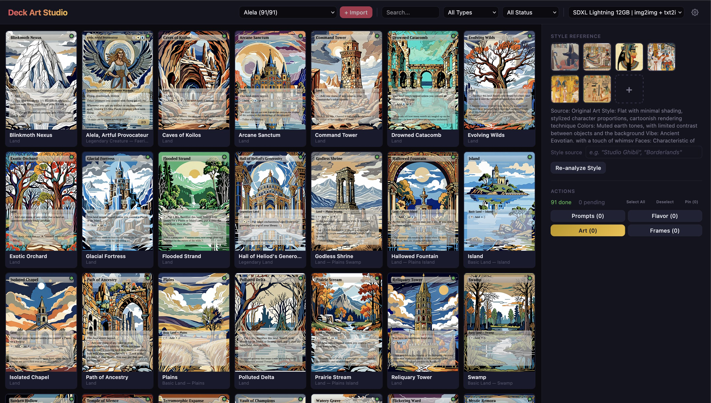
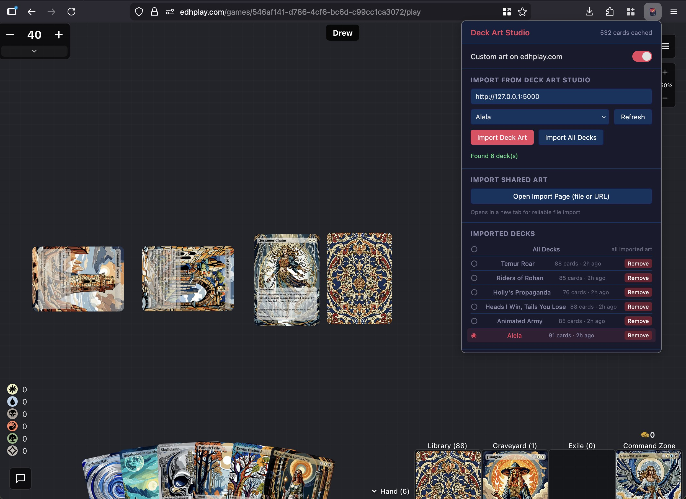
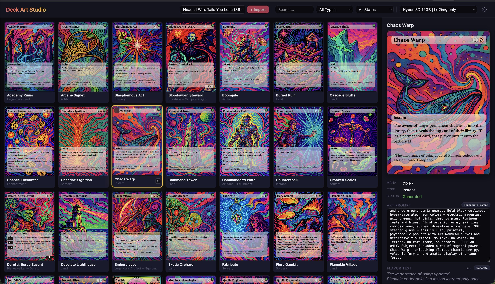
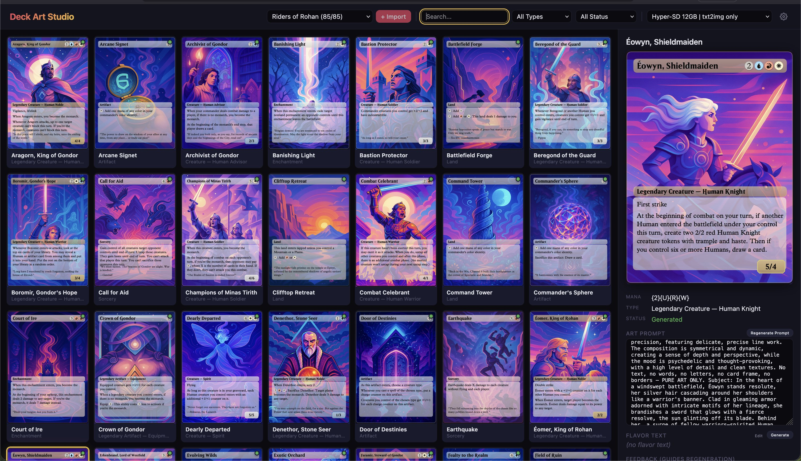
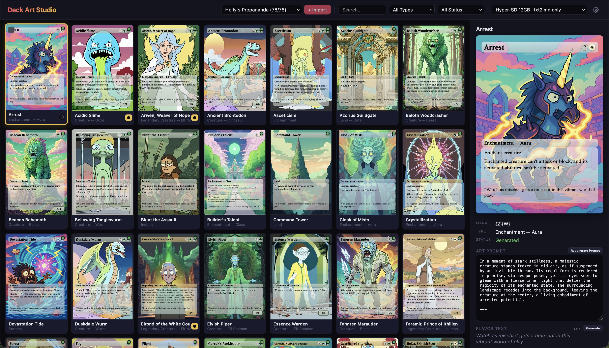
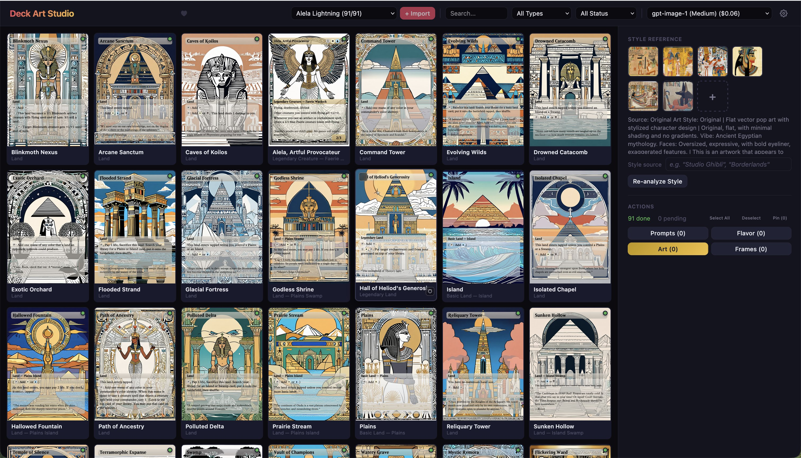
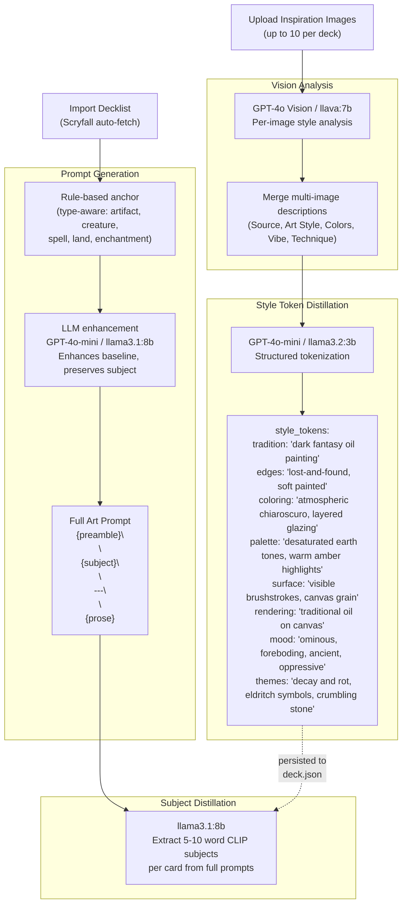
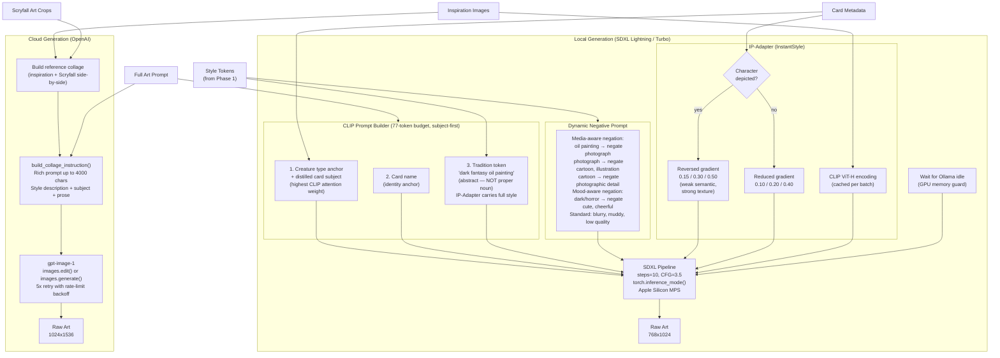
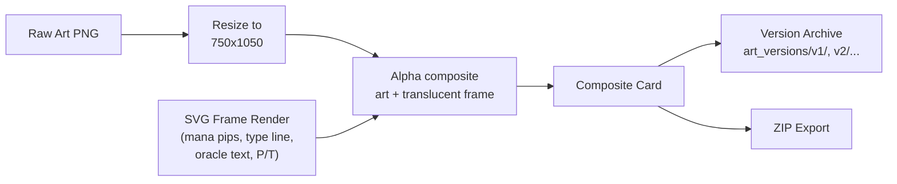

# Deck Art Studio

[](https://www.gnu.org/licenses/agpl-3.0)

A self-hosted web app for generating custom AI art for Magic: The Gathering proxy decks. Import any decklist, upload inspiration art, and generate unique artwork for every card using cloud or local AI models. Export your cards for proxy printing, or use the included browser extension to render your custom art on [edhplay.com](https://edhplay.com).





## Samples









## Features

- **Dual AI backends** — Cloud (OpenAI gpt-image-1, DALL-E 3) or fully local (SDXL Lightning + Ollama) on Apple Silicon
- **Style transfer** — Upload inspiration art, analyze its style, and generate all cards in that aesthetic
- **IP-Adapter style injection** — Local generation uses cross-attention style transfer from reference images
- **LLM-distilled style tokens** — Structured style analysis (tradition, edges, coloring, mood, palette, themes) drives CLIP prompts and dynamic negative prompts
- **Type-aware art prompts** — AI prompt generation with rule-based anchors ensures artifacts depict objects, creatures depict creatures, spells depict action
- **Multi-deck management** — Import, rename, delete, and switch between multiple decks
- **Scryfall integration** — Auto-fetches card data, art crops, and oracle text during import
- **Card frame rendering** — SVG-based borderless frames with mana pips, type lines, rules text, P/T, loyalty badges, and hybrid mana support
- **Version history** — Every generation is versioned; revert to any previous version
- **Feedback loop** — Regenerate individual cards with natural language direction
- **Batch generation** — Parallel generation with GPU memory guard, CLIP embedding caching, and progress tracking
- **Pinned cards** — Pin favorites to filter and protect from batch regeneration
- **ZIP export** — Download all composite cards as print-ready PNGs

## Quick Start

```bash
# Install dependencies
pip install -r requirements.txt

# Optional: local AI support (Apple Silicon recommended)
pip install torch torchvision diffusers transformers accelerate peft

# Run the app (defaults to port 5001 to avoid macOS AirPlay on 5000)
python3 deck_studio.py
```

Open `http://localhost:5001` in your browser.

## Usage Guide

### Step 1: Choose Your AI Backend

You need either a cloud API key or local models — pick one (or both).

**Cloud (OpenAI)** — Higher quality, costs per card (~$0.02-0.25 depending on model)
1. Get an API key from [platform.openai.com](https://platform.openai.com)
2. Click the **Models** button (top-right of the header bar) to open the Models panel
3. Under **Cloud (OpenAI)**, paste your API key and click **Connect**
4. Select a cloud model from the model dropdown in the header bar (gpt-image-1 recommended)

**Local (SDXL + Ollama)** — Free, runs on your machine, requires Apple Silicon with 16GB+ RAM
1. Install local AI deps: `pip install torch torchvision diffusers transformers accelerate peft`
2. Install [Ollama](https://ollama.com) (handles LLM prompts and vision analysis)
3. Open the **Models** panel and confirm a local model appears under **Local (Stable Diffusion)**
4. Select a local model from the model dropdown in the header bar (SDXL Lightning recommended)
5. Ollama models are pulled and managed automatically — no manual setup needed

### Step 2: Import a Deck

1. Click **"+ Import"** in the header bar (next to the deck dropdown)
2. Enter a deck name (e.g. "Coin Flip Chaos")
3. Paste your decklist in any standard format (Archidekt, MTGO, Arena export):
   ```
   1x Sol Ring
   1x Command Tower
   1x Okaun, Eye of Chaos (bbd) 6 [Commander]
   ```
4. Click **"Import & Fetch from Scryfall"** — card data, oracle text, and art crops are fetched automatically
5. Your new deck appears in the **deck dropdown** in the header bar — use it to switch between decks

### Step 3: Upload Inspiration Art

This is what makes your deck unique. Upload 1-10 images that represent the visual style you want.

1. In the **Style Reference** panel (right side), click the **"+"** button to upload an inspiration image
2. Good inspiration sources: concept art, illustration styles, album covers, movie stills — anything with a distinctive visual identity
3. Optionally type a **style source** label (e.g. "Studio Ghibli", "Borderlands") in the text field below your images
4. The app analyzes each image using AI vision (GPT-4o or llava) and distills a style description covering art tradition, linework, coloring, mood, and palette
5. Click **"Re-analyze Style"** at any time to rerun the analysis (useful after uploading additional images)

> **Tip:** The more consistent your inspiration images are in style, the more cohesive your deck's art will be. 3-5 images from the same artist or aesthetic work best.

### Step 4: Generate Art Prompts

Art prompts describe what each card's art should depict, informed by the card's type and your deck's style.

1. In the **action toolbar** (above the card grid), click **"Select All"** to select every card — or click individual card tiles in the grid to select specific cards
2. Click **"Prompts"** to generate art prompts for selected cards
3. Each prompt combines a rule-based anchor (so Sol Ring depicts a ring, not a sun) with LLM enhancement for creative detail

> **Tip:** Click any card tile to open the **detail panel** on the right. Each card has **two prompt fields** — **Local prompt** (used by SDXL) and **Cloud prompt** (used by OpenAI) — each with its own Regenerate button. Edit the one matching your selected model.

### Step 5: Generate Art

1. Select the cards you want to generate art for (or use **"Select All"** in the action toolbar)
2. Click **"Art"** to start batch generation
3. Progress updates appear on each card tile in the grid as art is generated
4. Generation speed depends on your backend:
   - **Cloud:** ~5-15 seconds per card
   - **Local SDXL:** ~45-65 seconds per card on Apple Silicon

> **Tip:** Click **"Flavor"** in the action toolbar to generate themed flavor text for selected cards — it's rendered onto each card frame alongside the rules text. You can also generate or edit flavor text per-card in the **Flavor text** section of the detail panel.

### Step 6: Review and Iterate

Click any card tile to open its **detail panel** on the right. Each card shows its generated art composited into a borderless frame with mana cost, type line, rules text, and power/toughness. The detail panel also lets you toggle orientation (**Portrait** / **Landscape**) and **Re-roll** the art with the current prompt.

- **Like a card?** Pin it (select cards and click **"Pin"** in the action toolbar) to protect it from future batch regenerations
- **Want changes?** Click a card, type feedback in the **"What to change..."** field (e.g. "make the background darker" or "add more fire"), and click **"Regenerate"** to redo just that card with your direction
- **Version history:** Every generation is saved. Scroll through the **Versions** thumbnails at the bottom of the detail panel and click any version to revert
- **Re-composite:** Select cards and click **"Frames"** in the action toolbar to re-render card frame overlays without regenerating the art (or use **"Re-render Frame"** in the detail panel for a single card)

### Step 7: Export

**For printing proxies:**
- Click the **`⋯`** menu next to the deck dropdown, then click **"Export ZIP"** to download all composite cards as print-ready PNGs

**For the EDH Play browser extension:**
- From the **`⋯`** menu, click **"Export for EDH Play"** to download a JSON manifest, then import it into the browser extension — see the [EDH Play Browser Extension](#edh-play-browser-extension) section below

**For sharing with friends:**
- Use the browser extension's **"Export All Art as .json"** to create a self-contained file (~3-4MB per deck) that anyone can import

## Generation Pipeline

The pipeline has three phases: **style analysis**, **art generation**, and **card compositing**.

### Phase 1: Style Analysis & Prompt Generation



### Phase 2: Art Generation

Two parallel paths — local SDXL or cloud OpenAI — selected by the user.



### Phase 3: Card Compositing & Output



### Key Design Decisions

| Decision | Rationale |
|----------|-----------|
| **Subject-first CLIP ordering** | CLIP's 77-token budget weights early tokens most heavily. Subject goes first so the card's identity dominates; style goes last because IP-Adapter carries the visual aesthetic from reference images. |
| **Tradition token, not proper noun** | CLIP encodes franchise names as both style AND character — causes character cloning. "dark fantasy oil painting" carries the visual tradition without triggering specific characters. |
| **Reversed IP-Adapter gradient** | Cross-attention layers go deep→shallow (semantic→textural). Reversed scale (weak→strong) suppresses character identity while maximizing texture/palette transfer. |
| **Media-aware dynamic negatives** | Negative prompt is derived from style_tokens: oil painting → negate photograph; cartoon → negate photographic detail; dark mood → negate cheerful. Pushes SDXL away from the wrong aesthetic. |
| **Observation-first vision analysis** | Vision prompts describe what the image actually shows rather than forcing classification into rigid categories. Prevents hallucinated styles (e.g. "cel-shaded" for oil paintings). |
| **Rule-based prompt anchor** | AI prompt generator receives a correct-but-bland baseline from the rule-based system. LLM enhances it creatively without inventing wrong subjects. |
| **Pre-encoded CLIP embeddings** | Inspiration composite encoded once per batch via ViT-H, cached by MD5 hash. Avoids expensive per-card re-encoding on Apple Silicon. |
| **Ollama GPU memory guard** | Threading.Event gates SDXL generation until Ollama models are fully unloaded. Prevents unified memory exhaustion on Apple Silicon. |

## EDH Play Browser Extension

A cross-browser extension (Firefox + Chrome) that replaces Scryfall card images on [edhplay.com](https://edhplay.com) with your custom AI-generated art. Your opponents see the original Scryfall art — you see your custom art.


### How It Works

The extension watches edhplay.com for `` elements pointing to `cards.scryfall.io` and swaps them with your custom art using a MutationObserver. Art is cached in the extension's IndexedDB so it persists across sessions.

For cards with multiple printings (e.g. basic lands), the extension resolves unknown Scryfall UUIDs via the Scryfall API and matches by card name.

### Installing the Extension

**Firefox:**
1. Open Firefox and paste this into the address bar: `about:debugging#/runtime/this-firefox`
2. Click **"Load Temporary Add-on..."**
3. Browse to the `extension/` folder and select `manifest.json`
4. The extension icon appears in your toolbar — you're done!

> **Note:** Temporary add-ons are removed when Firefox closes. You'll need to repeat these steps after restarting Firefox. For a permanent install, the extension can be [signed through AMO](https://extensionworkshop.com/documentation/publish/submitting-an-add-on/) as an unlisted add-on.

**Chrome:**
1. Open Chrome and paste this into the address bar: `chrome://extensions`
2. Turn on **"Developer mode"** (toggle in the top right)
3. Click **"Load unpacked"** and select the `extension/` folder
4. The extension icon appears in your toolbar

> **Note:** Chrome will show a "Disable developer mode extensions" popup on each launch. Just dismiss it — your extension keeps working.

### Importing Your Art

**From Deck Art Studio (for creators):**
1. Make sure Deck Art Studio is running (`python3 deck_studio.py`)
2. Click the extension icon to open the popup
3. The Studio URL defaults to `http://localhost:5001`
4. Select your deck from the dropdown and click **"Import Deck Art"**, or click **"Import All Decks"** to import every deck at once
5. Navigate to edhplay.com — your custom art replaces the Scryfall defaults

**From a shared .json file (for friends):**
1. Click the extension icon and click **"Open Import Page"**
2. Drag-and-drop the `.json` file onto the page, or click to browse
3. Each deck in the file appears in the **Imported Decks** list automatically

### Switching Decks

The **Imported Decks** section in the popup shows every deck you've imported, with card count and import time. Each deck has a radio selector:

- **Click a deck** to activate it — only that deck's art appears on edhplay.com
- **"All Decks"** shows art from every imported deck (useful if cards don't overlap)
- **"Remove"** deletes a deck's art from the cache

Art is stored per-deck in IndexedDB, so shared cards like Sol Ring or basic lands keep their correct art style per deck. Switching is instant — just click and the page updates.

### Sharing Art with Other Players

Art is exported as self-contained JSON manifests with embedded base64 JPEG images (~30-40KB per card, ~3-4MB for a full deck). Multi-deck exports preserve each deck's name and cards separately.

**Export:** Click **"Export All Art as .json"** in the popup. If a single deck is active, the file contains just that deck. If "All Decks" is active, every deck is included.

**Import:** Click **"Open Import Page"** in the popup, then:
- **From file:** Drop the `.json` file on the page or click to browse
- **From URL:** Paste a Google Drive, Dropbox, or direct link and click Fetch

Google Drive share links are auto-converted to direct download URLs.

### Extension Files

```
extension/
├── manifest.json            — WebExtensions Manifest V3 (Firefox + Chrome)
├── browser-polyfill.min.js  — Mozilla webextension-polyfill for cross-browser API
├── content.js               — MutationObserver image replacement on edhplay.com
├── background.js            — Service worker: IndexedDB access, manifest fetching
├── background-worker.js     — Chrome MV3 entry point (imports db.js + background.js)
├── db.js                    — IndexedDB wrapper (deck-scoped card storage)
├── popup.html/popup.js      — Extension popup UI (studio import, deck switching, export)
├── import.html/import.js    — Dedicated import page for shared art (file/URL)
└── icons/                   — Extension icons (16, 48, 128px)
```

## Project Structure

```
deck_studio.py              — Flask web app (UI + API, single-file, ~12K lines)
local_image_generator.py    — SDXL pipeline wrapper (Lightning, Turbo, Hyper-SD)
card_frame_renderer.py      — SVG card frame generation + art compositing
prompt_generator.py         — Rule-based and AI-enhanced art prompt generation
vision_analyzer.py          — Vision analysis + style token distillation
backend_config.py           — Cloud/local backend switching + Ollama lifecycle
scryfall_client.py          — Scryfall API client (card lookup, decklist parsing)
build_reference_collage.py  — Builds Scryfall art reference collages for generation
color_transfer.py           — Color palette transfer between images (requires numpy)
fetch_scryfall_art.py       — Downloads card art crops from Scryfall
fetch_flavor_text.py        — Fetches oracle/flavor text from Scryfall
fetch_mtg_fonts.py          — Downloads MTG card fonts (Beleren, MPlantin)
build_pips_from_mana.py     — Renders SVG mana symbols to PNG pip images
mana-master/                — SVG mana symbols (Andrew Gioia's Mana font)
static/                     — Favicon and touch icon assets
extension/                  — EDH Play browser extension (see below)
tests/                      — Unit test suite (pytest, ~185 tests)
.github/workflows/          — CI/CD (issue auto-fix, PR review, auto-release)
.githooks/                  — Pre-commit hook (runs tests before each commit)
requirements.txt            — Python dependencies
```

## Runtime Directories

These are created automatically and excluded from git:

- `decks/` — Per-deck data (card databases, prompts, generated art, versions)
- `shared/` — Shared caches (Scryfall art, fonts, pip renders)
- `ref_collages/` — Generated Scryfall reference collages for art generation

## Requirements

- Python 3.10+
- **Cloud mode**: OpenAI API key (~$0.02-0.25 per card depending on model)
- **Local mode**: Apple Silicon Mac with 16GB+ RAM, PyTorch with MPS support

## Development

### Running Tests

```bash
# Run all tests (~185 tests, <2s)
pytest tests/

# Run a single test file
pytest tests/test_clip_directives.py -v
```

### Pre-commit Hook

The project includes a pre-commit hook that runs the test suite before each commit. To enable it:

```bash
git config core.hooksPath .githooks
```

To skip the hook temporarily (not recommended): `git commit --no-verify`

### Running the Dev Server

```bash
# Kill any existing instance and start fresh
lsof -ti:5001 | xargs kill -9 2>/dev/null
python3 deck_studio.py --port 5001

# For LAN access (debug mode auto-disabled)
python3 deck_studio.py --host 0.0.0.0
```

After editing `deck_studio.py`, you must restart Flask to pick up changes.

### Contributing

Contributions are welcome! Please:

1. Fork the repo and create a feature branch
2. Enable the pre-commit hook (`git config core.hooksPath .githooks`)
3. Make sure `pytest tests/` passes before submitting a PR
4. For UI changes, test in the actual browser — Python-side tests don't cover the frontend

## License

The source code is licensed under the [GNU Affero General Public License v3.0](LICENSE) (AGPL-3.0) — free to use, modify, and share for personal and non-commercial purposes.

This software is not intended for commercial use. If you are a business or commercial entity interested in using Deck Art Studio, contact [drew@drewvalentine.com](mailto:drew@drewvalentine.com).

### Fan Content Disclaimer

Deck Art Studio is unofficial Fan Content permitted under the [Fan Content Policy](https://company.wizards.com/en/legal/fancontentpolicy). Not approved/endorsed by Wizards. Portions of the materials used are property of Wizards of the Coast. &copy; Wizards of the Coast LLC.

This tool generates **original AI artwork** — it does not reproduce, copy, or distribute official Wizards of the Coast art or card designs. Magic: The Gathering is a trademark of Wizards of the Coast LLC.

## Support

Deck Art Studio is free and open source. If you enjoy the tool, consider buying me a coffee:

[](https://ko-fi.com/drewvalentine)

## Decklist Format

Supports Archidekt, MTGO, and Arena export formats:

```
1x Sol Ring
1x Command Tower
1x Okaun, Eye of Chaos (bbd) 6 [Commander]
```

Lines containing `[Commander]` or `[Commanders]` are tagged as commanders.
