# Deck Art Studio

[](https://www.gnu.org/licenses/agpl-3.0)

A self-hosted web app for generating custom AI art for Magic: The Gathering proxy decks. Import any decklist, upload inspiration art, and generate unique artwork for every card — running **entirely on your own Apple Silicon Mac**, no API keys, no cloud, no per-image cost. Export your cards for proxy printing, or use the included browser extension to render your custom art on [edhplay.com](https://edhplay.com).

> **Apple Silicon only.** Image generation, prompt writing, and style analysis all run locally via Apple's **MLX** framework. Deck Art Studio used to support an OpenAI cloud backend and a PyTorch/Ollama local backend; both have been replaced by a single MLX-native pipeline (FLUX.1-schnell + Llama + Qwen2.5-VL). It needs an M-series Mac with **18 GB+ unified memory** (16 GB may work; see [Requirements](#requirements)).

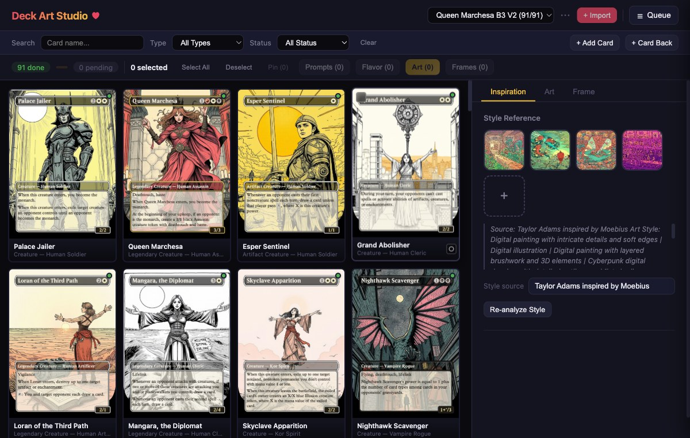

**One decklist in, a fully illustrated deck out.** Every card below was generated locally — same app, same cards, just a different set of inspiration images:

<p align="center">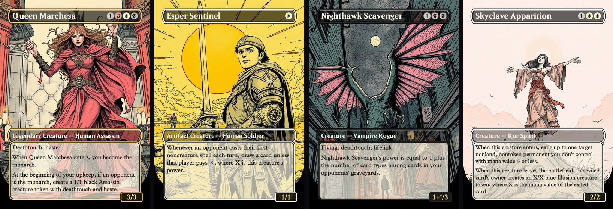</p>

<p align="center">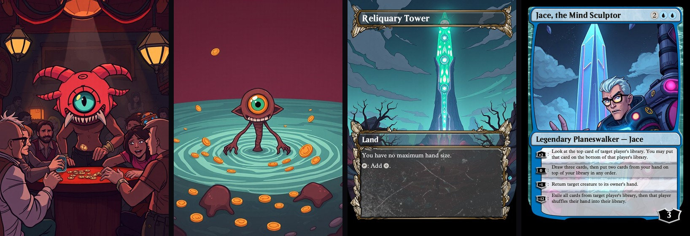</p>

Upload a few reference images and the style carries across your entire deck — creatures, lands, artifacts, sagas, battles, and double-faced cards alike.

## Features

- **100% local, MLX-native** — FLUX.1-schnell for images, Llama 3.x for prompts, Qwen2.5-VL for vision — all running on the Apple GPU. No API key, no cloud, no per-image cost.
- **Style transfer from any inspiration** — Upload 1–10 reference images. A procedural style pipeline classifies the medium, detects line weight (fine technical-pen vs bold outlines), and extracts the palette from your references — **deterministically**: re-analyzing a deck produces the same style block every time, so your look never drifts.
- **Franchise-safe styling** — Name a show as your style ("Rick & Morty", "Studio Ghibli") and you get its *look*, never its cast: franchise names are translated into de-named style language before they ever reach the image model, so the actual characters don't leak into your card art.
- **A real generation queue** — Art, prompts, flavor, and style analysis all flow through one global queue: enqueue instantly, keep browsing, switch decks freely — every job carries its own deck and keeps running. The queue drawer shows progress, supports cancel / bump-to-top / pause, and **pending jobs survive a server restart**.
- **Subject-faithful prompts** — Type-aware generation keeps each card's real subject as the focal point, opens with the creature's type ("Okaun, Eye of Chaos, a Cyclops Berserker, …"), depicts literal objects literally (a card named "Krark's Thumb" is a *thumb*), and gives a Cyclops exactly one eye.
- **Flavor-grounded scenes** — Prompts anchor in each card's flavor and rules text for concrete subject matter — with a firewall that keeps franchise quotes in flavor text from smuggling characters into the art.
- **Full card frames, many layouts** — SVG-rendered borderless frames with mana pips, hybrid mana, rules and flavor text, P/T and loyalty — including sagas, battles (landscape + defense shield), split cards, and double-faced backs. A WYSIWYG frame designer customizes colors per card or per deck.
- **Version history & steering** — Every generation is archived; revert any card to any version (prompt included). Re-roll on a fresh seed, or steer a prompt in plain language ("at night", "more menacing") and re-render.
- **Crash-safe memory model** — FLUX and the language/vision models run in separate subprocesses and are mutually evicted, so the heavy models never co-reside and exhaust an 18 GB machine (see [Architecture](#architecture--memory-model)).
- **Multi-deck management** — Import (Archidekt/MTGO/Arena formats, with Scryfall auto-fetch and rate-limit-safe retry), rename, delete, and switch decks freely.
- **Export anywhere** — Print-ready PNG ZIPs, or a self-contained JSON manifest for the included **browser extension** that shows your art on [edhplay.com](https://edhplay.com).

## Requirements

- **Apple Silicon Mac (M1/M2/M3/M4).** The generation stack uses Apple's Metal GPU via MLX; it does not run on Intel Macs, Windows, or Linux.
- **18 GB+ unified memory recommended.** FLUX.1-schnell peaks around 15.5 GB during generation. 16 GB machines may work but leave little headroom; 18 GB+ is the comfortable target (developed on an M3 Pro / 18 GB).
- **macOS 14+** and **Python 3.10+**.
- **~15–20 GB free disk** for the models, which download from Hugging Face on first use (FLUX ~6–9 GB, Qwen2.5-VL ~5 GB, Llama 3B/8B). No login or token required — the defaults are non-gated mirrors.

## Quick Start

```bash
# Install base + Apple-Silicon (MLX) dependencies
pip install -r requirements.txt -r requirements-mac.txt

# Run the app (defaults to port 5001 to avoid macOS AirPlay on 5000)
python3 deck_studio.py
```

Open `http://localhost:5001` in your browser.

> **First run** downloads the models from Hugging Face (one-time, ~15–20 GB). The image model is pre-selected and loads automatically the first time you generate — there is nothing to configure and no API key to enter.

## Usage Guide

### Step 1: Import a Deck

1. Click **"+ Import"** in the header bar (next to the deck dropdown).
2. Enter a deck name (e.g. "Coin Flip Chaos").
3. Paste your decklist in any standard format (Archidekt, MTGO, Arena export):
   ```
   1x Sol Ring
   1x Command Tower
   1x Okaun, Eye of Chaos (bbd) 6 [Commander]
   ```
4. Click **"Import & Fetch from Scryfall"** — card data, oracle text, flavor text, and art crops are fetched automatically.
5. Your new deck appears in the **deck dropdown** in the header bar — use it to switch between decks.

### Step 2: Upload Inspiration Art

This is what makes your deck unique. Upload 1–10 images that represent the visual style you want.

1. In the **Inspiration** panel, click **"+"** to upload an inspiration image.
2. Good sources: concept art, illustration styles, album covers, movie stills — anything with a distinctive visual identity.
3. Optionally type a **style source** label (e.g. "Studio Ghibli", "Borderlands"); when set, the analysis reconciles the image with what's known about that named style.
4. A vision model (**Qwen2.5-VL**) reads each image and distills FLUX-ready style descriptors — medium, linework, palette, lighting, and mood. This is cached per deck and applied to every card automatically.
5. Click **"Re-analyze Style"** any time to rerun the analysis (useful after adding images).

> **Tip:** The more consistent your inspiration images are, the more cohesive your deck's art will be. 3–5 images from the same artist or aesthetic work best.

The same pipeline, pointed at cartoon screenshots instead of fine-line illustration — the whole deck follows:

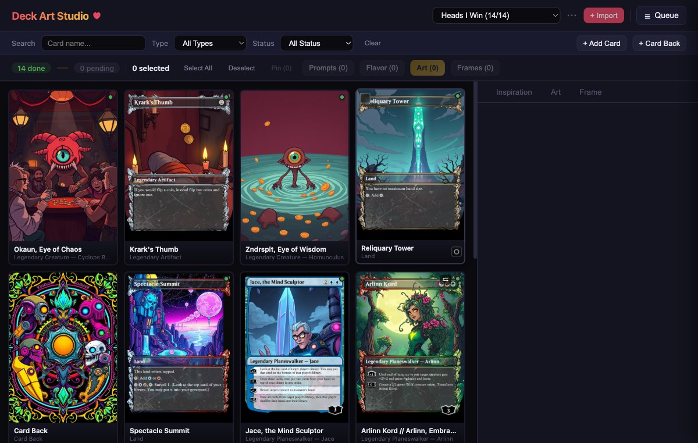

### Step 3: Generate Art Prompts

A prompt describes the **scene** each card depicts. The deck's style is applied automatically on top — so a prompt only needs to describe *what* to show, not the art style.

1. Select cards in the grid (or **"Select All"** in the action toolbar).
2. Click **"Prompts"** to generate a scene prompt for each selected card.
3. Each prompt combines a type-aware rule-based anchor (so the card's real subject stays the focal point) with LLM enhancement (**Llama 3.x**) and is grounded in the card's flavor and rules text.

> **Tip:** Click any card tile to open the **detail panel**. Each card has a single **Prompt** field — the scene. Use **Generate Random** for a brand-new random scene, or edit it directly, then render.

### Step 4: Generate Art

1. Select the cards you want art for (or **"Select All"**).
2. Click **"Art"** to start generation (~70 s/card on an M3 Pro). Progress updates appear on each card tile as it renders.

Everything runs through the **global generation queue** — click **Queue** in the header to open the drawer. Jobs are cancellable, re-orderable (bump to top), and pausable; each one carries its own deck, so you can switch decks and keep working while renders continue. Pending jobs even survive a server restart.

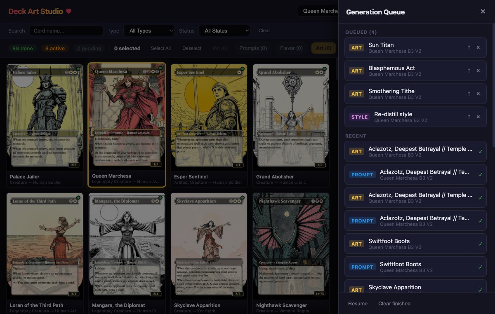

> **Tip:** Click **"Flavor"** in the action toolbar to generate themed flavor text for selected cards — it's rendered onto each card frame alongside the rules text. You can also edit flavor text per-card in the detail panel.

### Step 5: Review and Iterate

Click any card tile to open its **detail panel**. Each card shows its art composited into a borderless frame.

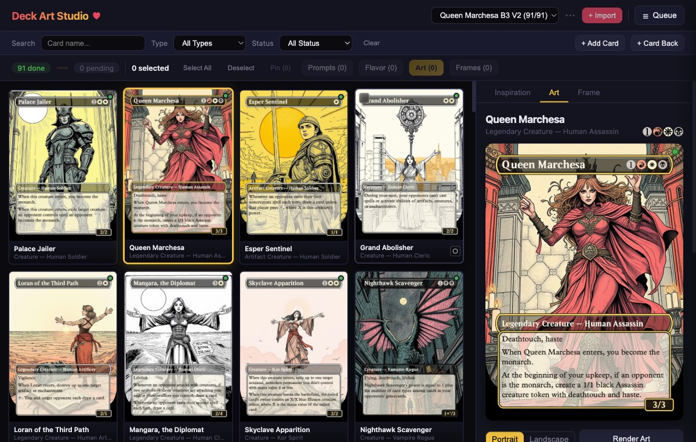

From here you can:

- **Render Art** — re-render the current prompt on a fresh seed (same scene, different take).
- **Steer & Render** — type a direction (e.g. "at night", "more menacing") and it rewrites the prompt that way, then renders.
- **Generate Random** — write a brand-new random scene prompt (doesn't render; edit it, then Render Art).
- **Portrait / Landscape** — toggle orientation.
- **Pin** a card (action toolbar) to protect it from batch regeneration.
- **Versions** — every generation is saved; scroll the thumbnails at the bottom of the detail panel and click any version to revert.
- **Frames** — re-render the card frame overlay without regenerating the art.

The **Frame** tab is a WYSIWYG designer: adjust border, frame, and title-bar colors with a live preview, then save per-card or apply to every checked card (or set the deck default used by new imports).

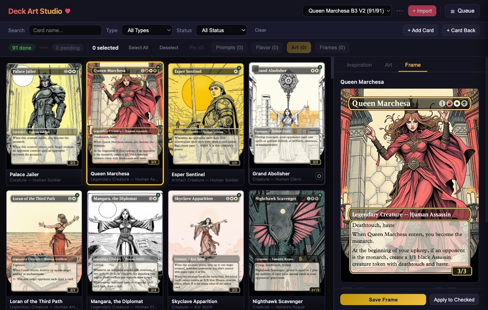

### Step 6: Export

**For printing proxies:** Click the **`⋯`** menu next to the deck dropdown → **"Export ZIP"** to download all composite cards as print-ready PNGs.

**For the EDH Play extension:** From the **`⋯`** menu → **"Export for EDH Play"** to download a JSON manifest, then import it into the browser extension (see [below](#edh-play-browser-extension)).

**For sharing with friends:** Use the extension's **"Export All Art as .json"** to create a self-contained file (~3–4 MB per deck) anyone can import.

## Architecture & Memory Model

The defining constraint is the **18 GB unified-memory budget**. macOS caps the GPU working set at ~13.3 GB, and FLUX.1-schnell uses nearly all of it — so FLUX and the language/vision models **cannot be resident at the same time**. Deck Art Studio enforces this with subprocess isolation:

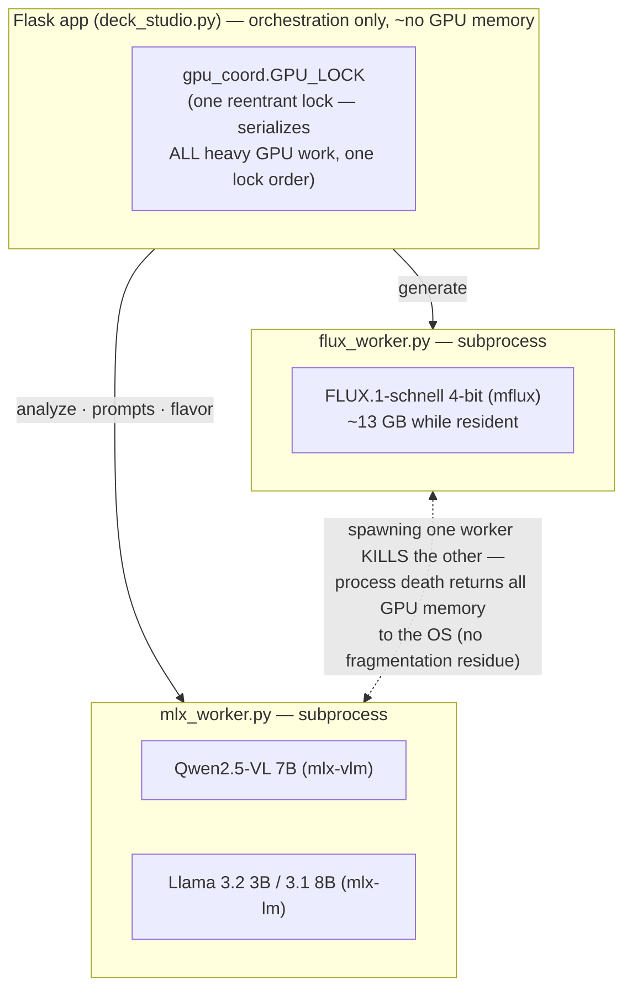

- **Only one worker is ever resident.** Before the Flask app sends work to one worker, it evicts the other by **killing its process** — the most reliable way to reclaim FLUX's ~13 GB on this hardware (`mx.clear_cache()` alone left fragments that still OOM-killed the server).
- **`gpu_coord.GPU_LOCK`** is a single reentrant lock both paths acquire as the outermost lock, giving one consistent order. It eliminates the cross-module deadlock that two independent locks caused, and prevents a style analysis from tearing down a live generation.
- **Inactivity watchdogs** kill a worker that goes silent past a timeout, so a stuck inference can never wedge the whole app.
- **Parent-death watchdogs** in each worker exit the subprocess if the Flask app dies, so a 13 GB worker can never orphan.

### Generation Pipeline

**Phase 1 — Style analysis & prompt generation** (runs in `mlx_worker`):

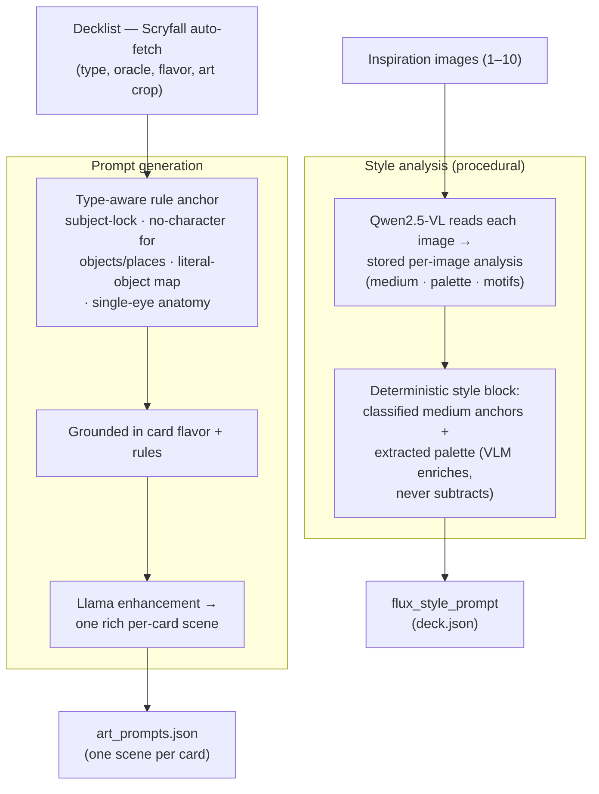

**Phase 2 — Art generation** (runs in `flux_worker`):

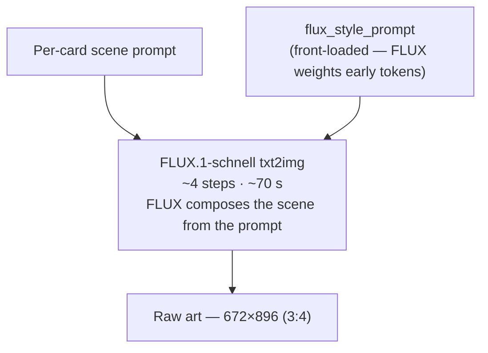

**Phase 3 — Card compositing & output:**

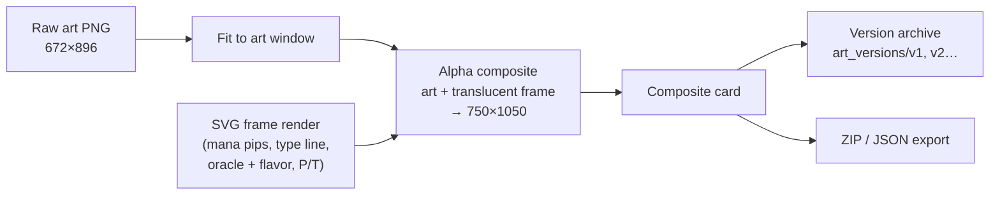

### Key Design Decisions

| Decision | Rationale |
|----------|-----------|
| **Subprocess isolation of FLUX and MLX** | Killing a worker process is the only reliable way to return FLUX's ~13 GB of GPU memory to the OS before the language/vision models load. In-process `clear_cache` left fragments that still OOM-killed the server on 18 GB. |
| **Single reentrant `GPU_LOCK`** | FLUX and MLX workers can't co-reside, so all heavy work is serialized under one outermost lock. One consistent lock order removes the AB-BA deadlock two independent module locks caused. |
| **672×896 (3:4) render resolution** | Matches the card frame's art window so composites align, and peaks ~15.5 GB — comfortably under the 13.3 GB working-set + 18 GB budget. 768×1024 peaked ~17.5 GB and routinely OOM-killed the app. |
| **Procedural style blocks** | The deck's style prompt is assembled from deterministic sources — a keyword-classified medium (with fine-vs-bold line detection) plus the palette extracted from the stored per-image analyses. The vision model only *enriches*; it can never subtract. Re-analyzing a deck reproduces the same style block, so the look never drifts between runs. |
| **Franchise de-naming** | A franchise name in a prompt summons its cast (a literal Rick once rendered as card art). Franchise names are translated at use time into de-named genre phrases + an "original character designs" guard; artist and movement names pass through verbatim. |
| **Durable queue** | Every queue mutation snapshots pending jobs to disk; a restart restores them (a job running at shutdown re-queues first). A routine restart can never silently destroy queued work. |
| **Front-loaded style** | FLUX's T5 encoder weights early tokens most heavily, so the style descriptors go first; a style buried after a long scene comes through weakly or not at all. |
| **Subject-lock prompts** | The card's own subject must dominate the frame. Object/place cards get no stray character, literal names depict the literal thing (Krark's Thumb → a thumb), and a Cyclops / "Eye of …" creature gets exactly one eye — the deck theme stays in the background. |
| **Flavor-grounded scenes** | Prompts anchor on the card's flavor and rules text, so they depict concrete subject matter instead of generic abstract "swirling magical energy." |

## EDH Play Browser Extension

A cross-browser extension (Firefox + Chrome) that replaces Scryfall card images on [edhplay.com](https://edhplay.com) with your custom AI-generated art. Your opponents see the original Scryfall art — you see your custom art.


### How It Works

The extension watches edhplay.com for `` elements pointing to `cards.scryfall.io` and swaps them with your custom art using a MutationObserver. Art is cached in the extension's IndexedDB so it persists across sessions.

For cards with multiple printings (e.g. basic lands), the extension resolves unknown Scryfall UUIDs via the Scryfall API and matches by card name.

### Installing the Extension

**Firefox:**
1. Open Firefox and paste this into the address bar: `about:debugging#/runtime/this-firefox`
2. Click **"Load Temporary Add-on..."**
3. Browse to the `extension/` folder and select `manifest.json`
4. The extension icon appears in your toolbar — you're done!

> **Note:** Temporary add-ons are removed when Firefox closes. You'll need to repeat these steps after restarting Firefox. For a permanent install, the extension can be [signed through AMO](https://extensionworkshop.com/documentation/publish/submitting-an-add-on/) as an unlisted add-on.

**Chrome:**
1. Open Chrome and paste this into the address bar: `chrome://extensions`
2. Turn on **"Developer mode"** (toggle in the top right)
3. Click **"Load unpacked"** and select the `extension/` folder
4. The extension icon appears in your toolbar

> **Note:** Chrome will show a "Disable developer mode extensions" popup on each launch. Just dismiss it — your extension keeps working.

### Importing Your Art

**From Deck Art Studio (for creators):**
1. Make sure Deck Art Studio is running (`python3 deck_studio.py`)
2. Click the extension icon to open the popup
3. The Studio URL defaults to `http://localhost:5001`
4. Select your deck from the dropdown and click **"Import Deck Art"**, or click **"Import All Decks"** to import every deck at once
5. Navigate to edhplay.com — your custom art replaces the Scryfall defaults

**From a shared .json file (for friends):**
1. Click the extension icon and click **"Open Import Page"**
2. Drag-and-drop the `.json` file onto the page, or click to browse
3. Each deck in the file appears in the **Imported Decks** list automatically

### Switching Decks

The **Imported Decks** section in the popup shows every deck you've imported, with card count and import time. Each deck has a radio selector:

- **Click a deck** to activate it — only that deck's art appears on edhplay.com
- **"All Decks"** shows art from every imported deck (useful if cards don't overlap)
- **"Remove"** deletes a deck's art from the cache

Art is stored per-deck in IndexedDB, so shared cards like Sol Ring or basic lands keep their correct art style per deck. Switching is instant — just click and the page updates.

### Sharing Art with Other Players

Art is exported as self-contained JSON manifests with embedded base64 JPEG images (~30–40 KB per card, ~3–4 MB for a full deck). Multi-deck exports preserve each deck's name and cards separately.

**Export:** Click **"Export All Art as .json"** in the popup. If a single deck is active, the file contains just that deck. If "All Decks" is active, every deck is included.

**Import:** Click **"Open Import Page"** in the popup, then:
- **From file:** Drop the `.json` file on the page or click to browse
- **From URL:** Paste a Google Drive, Dropbox, or direct link and click Fetch

Google Drive share links are auto-converted to direct download URLs.

### Extension Files

```
extension/
├── manifest.json            — WebExtensions Manifest V3 (Firefox + Chrome)
├── browser-polyfill.min.js  — Mozilla webextension-polyfill for cross-browser API
├── content.js               — MutationObserver image replacement on edhplay.com
├── background.js            — Service worker: IndexedDB access, manifest fetching
├── background-worker.js     — Chrome MV3 entry point (imports db.js + background.js)
├── db.js                    — IndexedDB wrapper (deck-scoped card storage)
├── popup.html/popup.js      — Extension popup UI (studio import, deck switching, export)
├── import.html/import.js    — Dedicated import page for shared art (file/URL)
└── icons/                   — Extension icons (16, 48, 128px)
```

## Project Structure

```
deck_studio.py              — Flask web app (UI + API, single-file, ~12K lines)
gpu_coord.py                — Shared GPU_LOCK + worker inactivity watchdog (serializes FLUX/MLX)
local_image_generator.py    — FLUX.1-schnell driver; spawns/controls the image worker
flux_worker.py              — FLUX image-generation subprocess (mflux)
mlx_worker.py               — MLX text + vision subprocess (mlx-lm + mlx-vlm)
mlx_llm.py                  — Parent-side client for the MLX worker (chat + vision)
prompt_generator.py         — Rule-based + LLM art prompt generation (subject-lock, flavor-grounded)
vision_analyzer.py          — Inspiration style analysis → FLUX style descriptors
backend_config.py           — MLX model selection + persistence
card_frame_renderer.py      — SVG card frame generation + art compositing
scryfall_client.py          — Scryfall API client (card lookup, decklist parsing)
fetch_scryfall_art.py       — Downloads card art crops from Scryfall
fetch_flavor_text.py        — Fetches oracle/flavor text from Scryfall
fetch_mtg_fonts.py          — Downloads MTG card fonts (Beleren, MPlantin)
build_pips_from_mana.py     — Renders SVG mana symbols to PNG pip images
build_reference_collage.py  — Builds Scryfall art reference collages (legacy helper)
color_transfer.py           — Color palette transfer between images (requires numpy)
mana-master/                — SVG mana symbols (Andrew Gioia's Mana font)
static/                     — Favicon and touch icon assets
extension/                  — EDH Play browser extension (see above)
tests/                      — Unit test suite (pytest, ~185 tests)
.github/workflows/          — CI/CD (issue auto-fix, PR review, auto-release)
.githooks/                  — Pre-commit hook (runs tests before each commit)
requirements.txt            — Base dependencies (installable everywhere, incl. CI)
requirements-mac.txt        — Apple-Silicon MLX stack (mflux, mlx-lm, mlx-vlm)
```

> The MLX packages (`mflux`, `mlx-lm`, `mlx-vlm`) are Apple-Silicon-only and are imported lazily, so the core modules still import on the Ubuntu CI runner using only `requirements.txt`.

## Runtime Directories

These are created automatically and excluded from git:

- `decks/` — Per-deck data (card databases, prompts, generated art, versions)
- `shared/` — Shared caches (Scryfall art, fonts, pip renders)
- `ref_collages/` — Generated Scryfall reference collages (legacy)

Model weights are cached by Hugging Face under `~/.cache/huggingface/` and shared across all decks.

## Development

### Running Tests

```bash
# Run all tests (~185 tests, <2s)
pytest tests/

# Run a single test file
pytest tests/test_clip_directives.py -v
```

The unit tests run without MLX (the heavy imports are lazy), so they pass on any platform.

### Pre-commit Hook

The project includes a pre-commit hook that runs the test suite before each commit. To enable it:

```bash
git config core.hooksPath .githooks
```

To skip the hook temporarily (not recommended): `git commit --no-verify`

### Running the Dev Server

```bash
# Kill any existing instance and start fresh
lsof -ti:5001 | xargs kill -9 2>/dev/null
python3 deck_studio.py --port 5001

# For LAN access (debug mode auto-disabled)
python3 deck_studio.py --host 0.0.0.0
```

After editing `deck_studio.py`, you must restart Flask to pick up changes. (The `flux_worker.py` / `mlx_worker.py` subprocesses are re-spawned on demand, so edits to them are picked up on the next generation without a manual restart.)

### Contributing

Contributions are welcome! Please:

1. Fork the repo and create a feature branch
2. Enable the pre-commit hook (`git config core.hooksPath .githooks`)
3. Make sure `pytest tests/` passes before submitting a PR
4. For UI changes, test in the actual browser — Python-side tests don't cover the frontend

## License

The source code is licensed under the [GNU Affero General Public License v3.0](LICENSE) (AGPL-3.0) — free to use, modify, and share for personal and non-commercial purposes.

This software is not intended for commercial use. If you are a business or commercial entity interested in using Deck Art Studio, contact me.

### Fan Content Disclaimer

Deck Art Studio is unofficial Fan Content permitted under the [Fan Content Policy](https://company.wizards.com/en/legal/fancontentpolicy). Not approved/endorsed by Wizards. Portions of the materials used are property of Wizards of the Coast. &copy; Wizards of the Coast LLC.

This tool generates **original AI artwork** — it does not reproduce, copy, or distribute official Wizards of the Coast art or card designs. Magic: The Gathering is a trademark of Wizards of the Coast LLC.

### Credits

Card frame artwork is composited from the open-source **[CardConjurer](https://github.com/ImKyle4815/cardconjurer)** project (© Kyle Burton and contributors, GPL-3.0), via the [maintained fork](https://github.com/Investigamer/cardconjurer). Mana symbols are from [Mana](https://github.com/andrewgioia/mana) by Andrew Gioia. See [NOTICE](NOTICE) for full third-party attributions.

## Support

Deck Art Studio is free and open source. If you enjoy the tool, consider buying me a coffee:

[](https://ko-fi.com/drewvalentine)

## Decklist Format

Supports Archidekt, MTGO, and Arena export formats:

```
1x Sol Ring
1x Command Tower
1x Okaun, Eye of Chaos (bbd) 6 [Commander]
```

Lines containing `[Commander]` or `[Commanders]` are tagged as commanders.
