# Deck Art Studio

[](https://www.gnu.org/licenses/agpl-3.0)

**Custom art for every card in your Magic deck, made on your own Mac.** Paste a decklist, drop in a few pictures whose look you love, and Deck Art Studio illustrates the whole deck in that style, frames every card, and hands you print-ready proxies. Nothing leaves your machine and nothing costs per image.

<p align="center"><picture>
  <source media="(prefers-color-scheme: dark)" srcset="docs/images/hero-gallery-dark.jpg">
  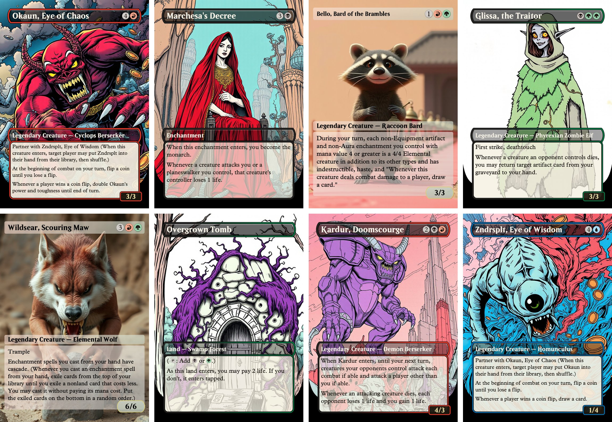
</picture></p>

**Every card above was generated on a laptop.** Four real Commander decks, four styles, each learned from a handful of reference images. The same pipeline handled ink drawings, comic pages, paintings and live-action film stills without a line of per-style code.

## Get started in two steps

**1. Install** (Apple Silicon Mac, Python 3.10+):

```bash
git clone https://github.com/drew-valentine/deck-art-studio.git
cd deck-art-studio
pip install -r requirements.txt -r requirements-mac.txt
```

**2. Run**, then open [http://localhost:5001](http://localhost:5001):

```bash
python3 deck_studio.py
```

In the app: click **Import** and paste your decklist, add three to five reference images in the **Inspiration** panel, select all cards and press **Art**. The first run downloads the models (about 20 GB, one time, no account or API key). After that a card takes about a minute on an M3 Pro.

> **What you need:** an M-series Mac with 18 GB of unified memory or more (16 GB can work with little headroom), macOS 14+, and roughly 20 GB of free disk for the models. Intel Macs, Windows and Linux are not supported: the whole stack runs on Apple's GPU through MLX.

## What it makes

<p align="center"><picture>
  <source media="(prefers-color-scheme: dark)" srcset="docs/images/samples-fineline-dark.jpg">
  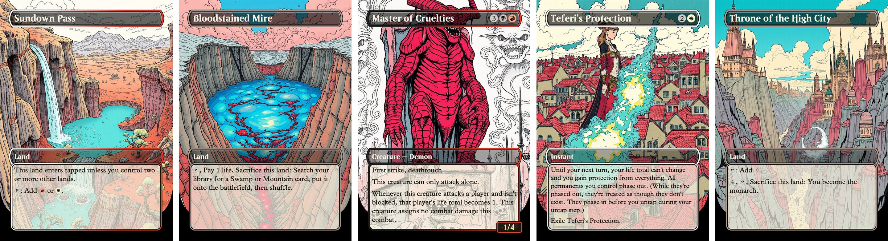
</picture></p>
<p align="center"><em>Fine-line ink — teal, coral and gold on parchment: a pillar of fire in a dead wood, a blood-veined sinkhole, a mage phasing out above the rooftops, a sunburst through a ruined nave, a canyon at sundown</em></p>

<p align="center"><picture>
  <source media="(prefers-color-scheme: dark)" srcset="docs/images/samples-picturebook-dark.jpg">
  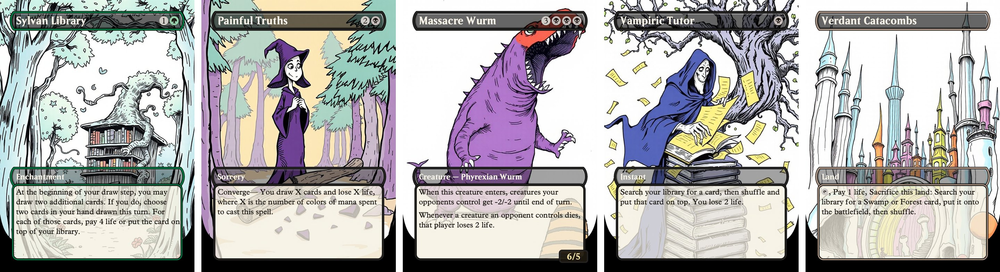
</picture></p>
<p align="center"><em>Picture-book pen and ink — a treehouse library, a tutor buried in books, a pact signed at a door under falling paper, a clockwork fox, a scrap-diving bird in rainbow feathers</em></p>

<p align="center"><picture>
  <source media="(prefers-color-scheme: dark)" srcset="docs/images/samples-comic-dark.jpg">
  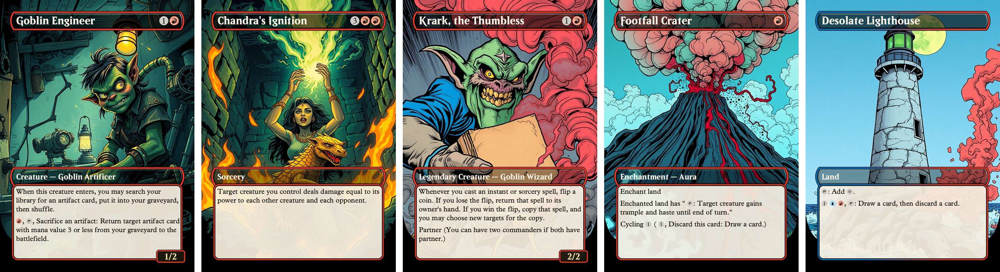
</picture></p>
<p align="center"><em>Comic-book ink — teal-and-coral smoke: a goblin in her workshop, a pyromancer's ignition, a goblin wizard with a coin to flip, a crater blowing its top, a lighthouse under a green moon</em></p>

<p align="center"><picture>
  <source media="(prefers-color-scheme: dark)" srcset="docs/images/samples-filmstill-dark.jpg">
  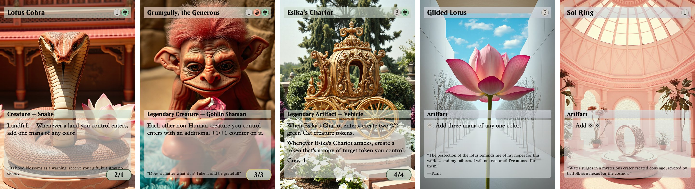
</picture></p>
<p align="center"><em>Pastel film stills — symmetrical sets and deadpan animals under flat, even light: a cobra on a lotus, a goblin offering a gem, a gilded chariot, a lotus in a white hall, a ring under a pink dome</em></p>

The style carries across the entire deck: creatures, lands, artifacts, sagas, battles and double-faced cards alike.

## Why it works

- **Your references set the style.** A vision model reads your images and the app measures them too: medium, line character, palette, lighting and how scenes are staged. The result is a deterministic style description, so re-analysing a deck gives the same look every time. The references also feed the image model directly, so palette and finish come through even where words fall short; a per-deck **Reference strength** dial (Off, Light, Medium, Strong) sets how much.
- **Every card stays itself.** Prompts open with the card's real subject and creature type, keep literal objects literal (a card named for a thumb shows a thumb), give a cyclops one eye, and draw the scene from the card's own rules and flavor text. An inspector checks each render for extra limbs, missing faces, stray lettering and signatures, and re-rolls the misses.
- **Name a style without importing its cast.** Type a show or a film as your style and you get its look, never its characters: names are translated into style language before they reach the image model.
- **Nothing you try is lost.** Every render is archived with the prompt that made it. Re-roll, steer in plain language ("at night", "more menacing"), and step back through every take of a card, prompt included.
- **A real queue.** Art, prompts, flavor text and style analysis run through one queue that survives a restart. Enqueue a deck and keep working on another.
- **Finished cards, not just art.** SVG frames with mana pips, rules and flavor text, power and toughness, loyalty, sagas, battles, split cards and card backs. Twelve frame themes, coloured from each card's mana identity, with a live designer for overrides.
- **Play with it online.** Export a manifest for the included browser extension and your art replaces the card images on [edhplay.com](https://edhplay.com).

## Using the studio

### Import a deck

Click **Import**, name the deck, and paste a decklist in Archidekt, MTGO or Arena format:

```
1x Sol Ring
1x Command Tower
1x Okaun, Eye of Chaos (bbd) 6 [Commander]
```

Card data, rules text, flavor text and reference art are fetched from Scryfall. The deck appears in the header dropdown; switch decks there at any time.

### Add inspiration

Upload one to ten images in the **Inspiration** panel. Concept art, illustration, album covers and film stills all work; three to five images from one artist or one aesthetic give the most cohesive deck. Optionally name the style source (a movement, an artist, a film) and the analysis reconciles your images with what it knows about that name. Click **Re-analyze Style** after adding images.

The same pipeline pointed at cartoon screenshots instead of fine-line illustration:

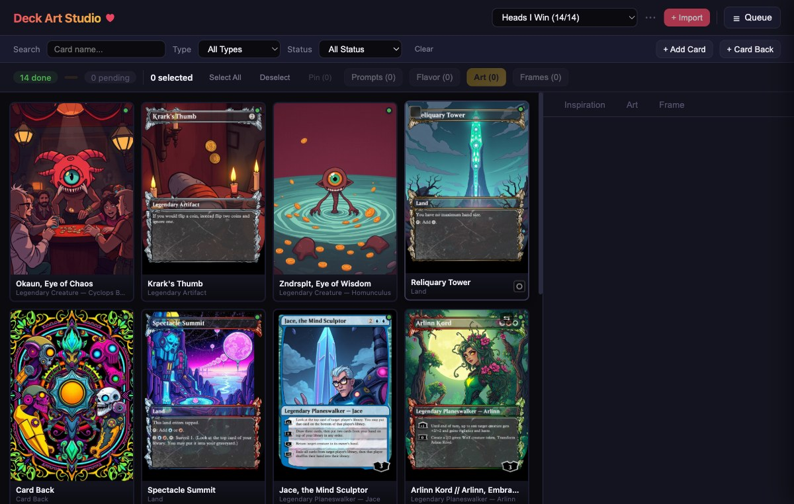

### Generate

Select cards (or **Select All**), press **Prompts** to write a scene for each card, then **Art** to render them. Everything runs through the global queue; click **Queue** in the header to watch it:

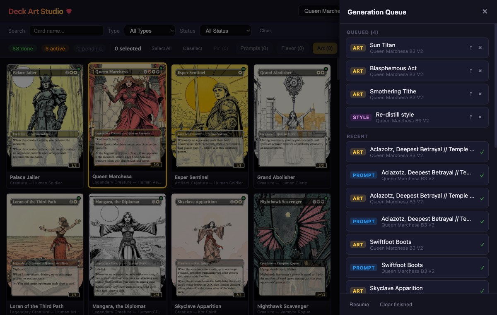

Jobs carry their own deck, can be cancelled, bumped to the top or paused, and pending jobs are saved to disk, so a restart picks up where it left off. **Flavor** writes themed flavor text for selected cards and renders it onto the frame.

### Iterate

Click a card to open its detail panel:

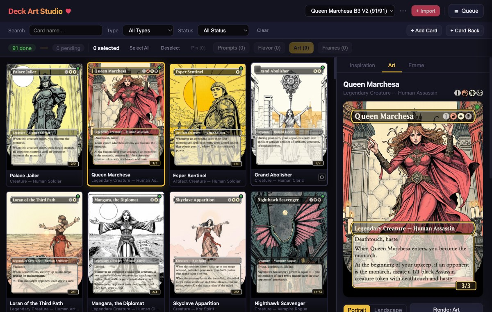

- **Render Art** re-renders the current prompt on a fresh take.
- **Steer & Render** rewrites the prompt in the direction you type, then renders.
- **Generate Random** writes a new scene; edit it, then render.
- **Portrait / Landscape** sets orientation. **Pin** protects a card from batch regeneration.

Every render is archived as a version with its prompt. This commander has been through 31 takes; any of them is one click from being current again:

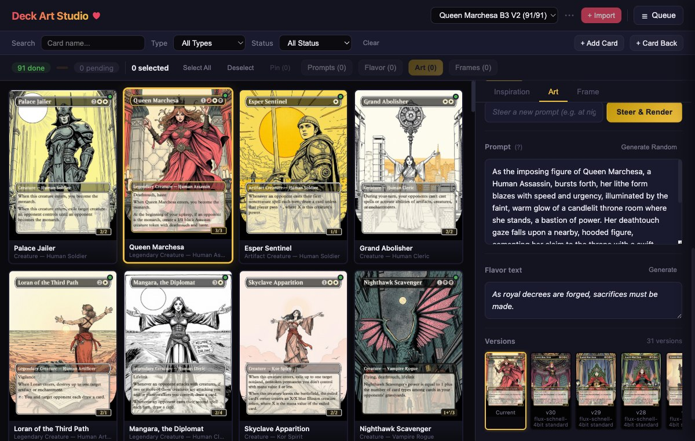

### Design the frame

The **Frame** tab is a live designer. Twelve themes render the same card differently:

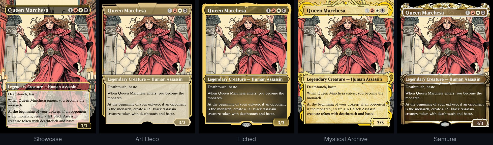

Colours derive from each card's mana identity (blend, split or gold for multicolour) and every colour can be overridden with a live preview:

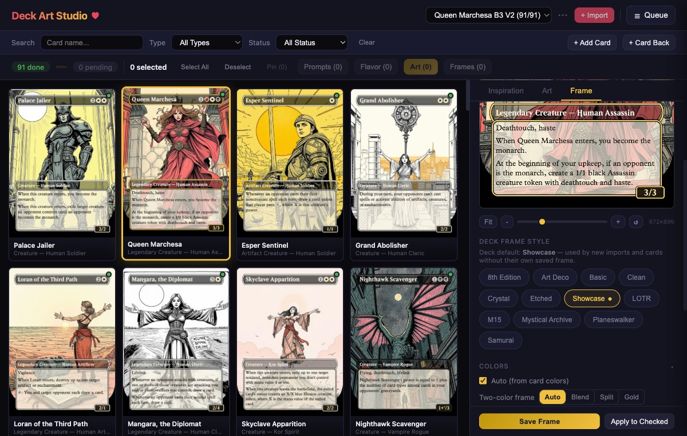

Save per card, apply to every checked card, or set a deck default that new imports pick up.

### Export

From the **⋯** menu next to the deck dropdown:

- **Export ZIP** downloads every composited card as a print-ready PNG.
- **Export for EDH Play** downloads a JSON manifest for the browser extension below.

## Show it on edhplay.com

The `extension/` folder is a Firefox and Chrome extension that swaps the card images on [edhplay.com](https://edhplay.com) for your art. Your opponents see the usual Scryfall art; you see your deck.

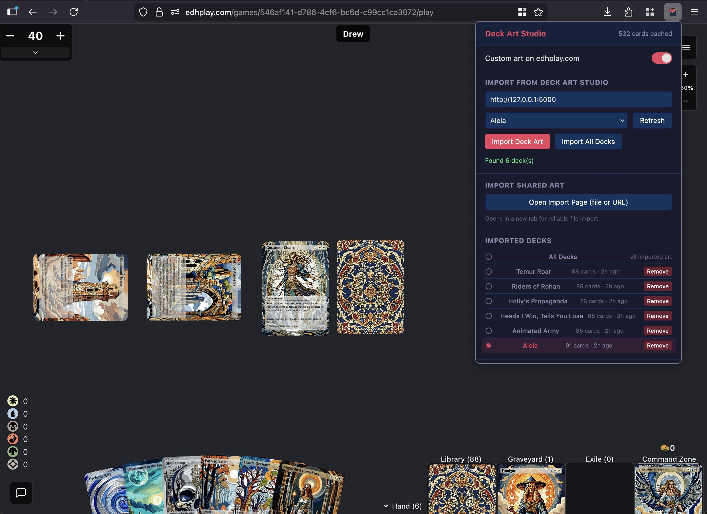

**Install it.** Firefox: open `about:debugging#/runtime/this-firefox`, choose **Load Temporary Add-on** and pick `extension/manifest.json` (temporary add-ons are removed when Firefox closes). Chrome: open `chrome://extensions`, enable **Developer mode**, choose **Load unpacked** and select the `extension/` folder.

**Load your art.** With Deck Art Studio running, click the extension icon, pick a deck and press **Import Deck Art** (or **Import All Decks**). Then open edhplay.com.

**Share with friends.** **Export All Art as .json** in the popup produces a self-contained file (about 3 to 4 MB per deck). Anyone with the extension can load it from **Open Import Page**, by file or by link; Google Drive share links are converted automatically. Imported decks are listed in the popup, and one click switches which deck's art shows.

The extension resolves unknown Scryfall printings by card name, so basic lands and reprints get the right art. Everything is cached in the browser's IndexedDB.

## Under the hood

Three local models share one Apple GPU: **FLUX.1-schnell** paints, **Llama 3** writes scenes, and **Qwen2.5-VL** reads references and inspects renders. FLUX needs about 13 GB while resident, so it and the language models can never be loaded together on an 18 GB machine. Each runs in its own subprocess, one is evicted before the other loads, and a single lock serialises all GPU work. Watchdogs kill a worker that goes silent and exit a worker whose parent has died, so a stuck inference can never wedge the app or orphan 13 GB of memory.

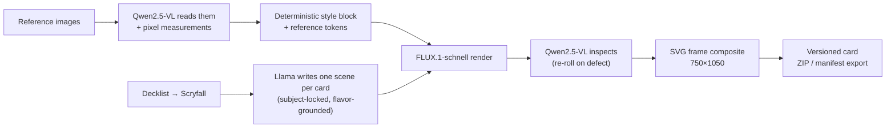
```mermaid
flowchart LR
    INSP["Reference images"] --> VLM["Qwen2.5-VL reads them\n+ pixel measurements"] --> STYLE["Deterministic style block\n+ reference tokens"]
    DECK["Decklist → Scryfall"] --> WRITER["Llama writes one scene per card\n(subject-locked, flavor-grounded)"]
    STYLE --> FLUX["FLUX.1-schnell render"]
    WRITER --> FLUX
    FLUX --> INSPECT["Qwen2.5-VL inspects\n(re-roll on defect)"] --> FRAME["SVG frame composite\n750×1050"] --> OUT["Versioned card\nZIP / manifest export"]
```

A few decisions that shaped the design:

| Decision | Why |
|----------|-----|
| **Subprocess isolation** | Killing a worker is the only reliable way to hand FLUX's 13 GB back to the OS. In-process cache clearing left fragments that still ran the machine out of memory. |
| **Deterministic style blocks** | The style description is assembled from a classified medium, measured palette and lighting, and majority votes over per-image reads. The vision model enriches but never subtracts, so a deck's look never drifts between analyses. |
| **References as image tokens** | The style block says what to draw; the references, averaged and injected only into the early image blocks, carry palette and finish without copying their subjects. |
| **Subject-locked prompts** | The card's own subject must dominate the frame: literal names show the literal thing, objects and places get no stray characters, and a cyclops gets one eye. |
| **Durable queue** | Every queue change is snapshotted to disk. A restart restores pending work, and a job that was running re-queues first. |

## Project layout

```
deck_studio.py              — Flask app: UI, API, queue and orchestration (single file)
gpu_coord.py                — The GPU lock and worker watchdogs
local_image_generator.py    — FLUX driver; spawns and controls the image worker
flux_worker.py              — FLUX image-generation subprocess (mflux)
mlx_worker.py               — Text and vision subprocess (mlx-lm, mlx-vlm)
mlx_llm.py                  — Client for the MLX worker (chat and vision)
prompt_generator.py         — Scene writing: subject lock, flavor grounding, backstops
vision_analyzer.py          — Reference analysis, style distillation, render inspection
card_frame_renderer.py      — SVG card frames and art compositing
scryfall_client.py          — Scryfall lookups and decklist parsing
extension/                  — EDH Play browser extension
tests/                      — pytest suite (runs without MLX, so it passes anywhere)
requirements.txt            — Base dependencies (any platform)
requirements-mac.txt        — Apple Silicon MLX stack (mflux, mlx-lm, mlx-vlm)
```

Runtime data lives in `decks/` (one folder per deck: cards, prompts, art, versions) and `shared/` (Scryfall art, fonts, mana pips). Model weights are cached by Hugging Face under `~/.cache/huggingface/`.

## Development

```bash
pytest tests/                                  # the suite runs in a few seconds, no GPU needed
git config core.hooksPath .githooks            # run the tests before every commit
python3 deck_studio.py --port 5001             # dev server; restart after editing deck_studio.py
python3 deck_studio.py --host 0.0.0.0          # reachable on your LAN (debug mode off)
```

The worker subprocesses are spawned on demand, so edits to `flux_worker.py` and `mlx_worker.py` take effect on the next job without a restart.

**Contributing:** fork, branch, enable the pre-commit hook, keep `pytest tests/` green, and test UI changes in a real browser. Issues and pull requests are welcome.

## License

The source code is licensed under the [GNU Affero General Public License v3.0](LICENSE): free to use, modify and share for personal and non-commercial purposes. If you are a business interested in using Deck Art Studio, get in touch.

**Fan content.** Deck Art Studio is unofficial Fan Content permitted under the [Fan Content Policy](https://company.wizards.com/en/legal/fancontentpolicy). Not approved or endorsed by Wizards. Portions of the materials used are property of Wizards of the Coast. &copy; Wizards of the Coast LLC. The tool generates original artwork; it does not reproduce or distribute official card art. Magic: The Gathering is a trademark of Wizards of the Coast LLC.

**Credits.** Card frames are composited from the open-source [CardConjurer](https://github.com/ImKyle4815/cardconjurer) project (&copy; Kyle Burton and contributors, GPL-3.0) via the [maintained fork](https://github.com/Investigamer/cardconjurer). Mana symbols are from [Mana](https://github.com/andrewgioia/mana) by Andrew Gioia. See [NOTICE](NOTICE) for full third-party attributions.

**Support.** Deck Art Studio is free and open source. If it made you a deck you love, consider buying me a coffee:

[](https://ko-fi.com/drewvalentine)
